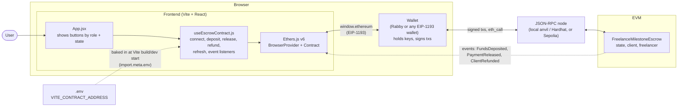
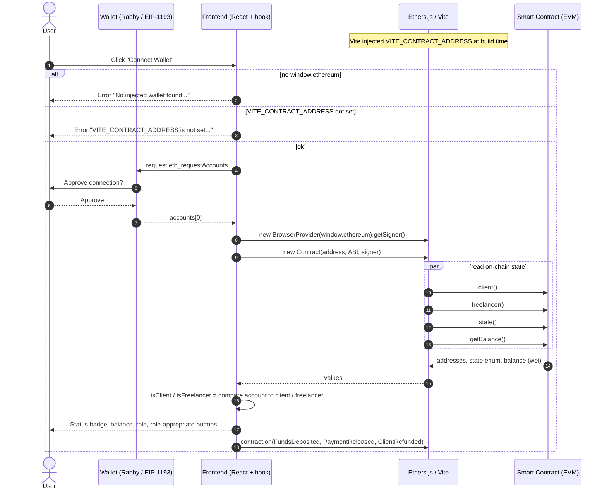
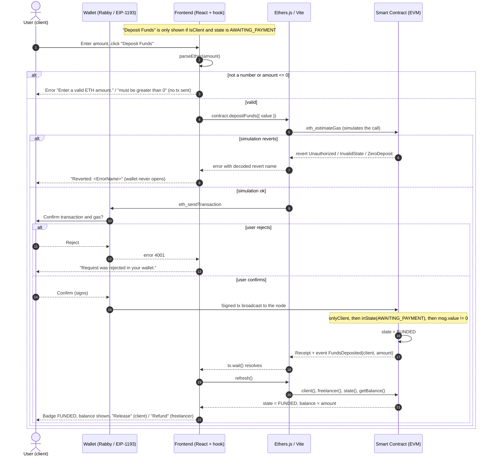
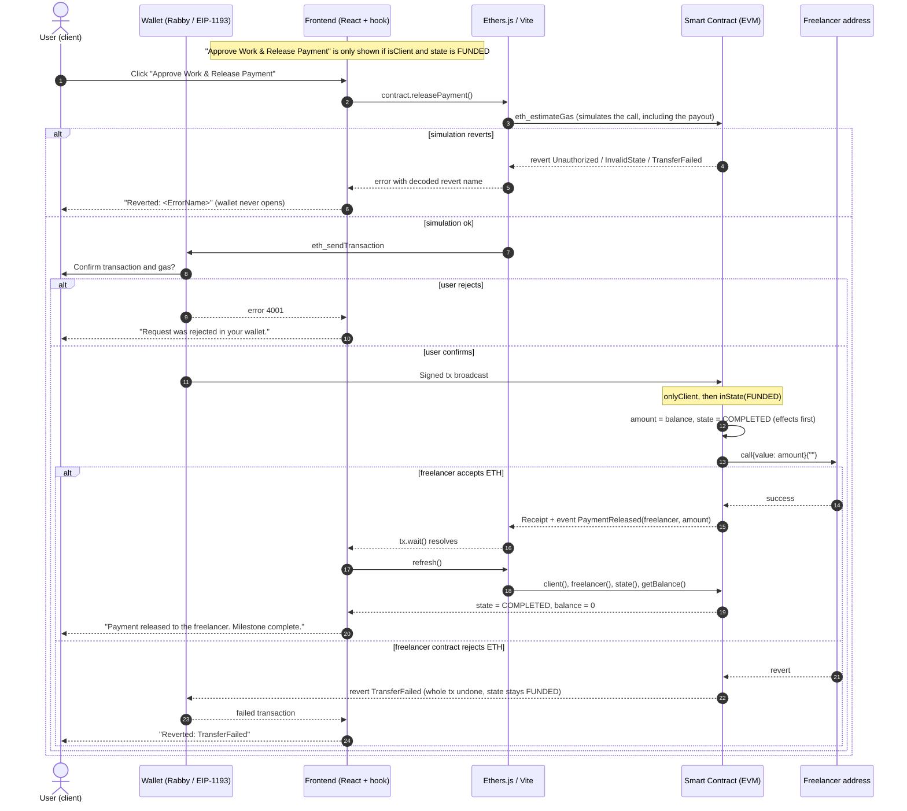
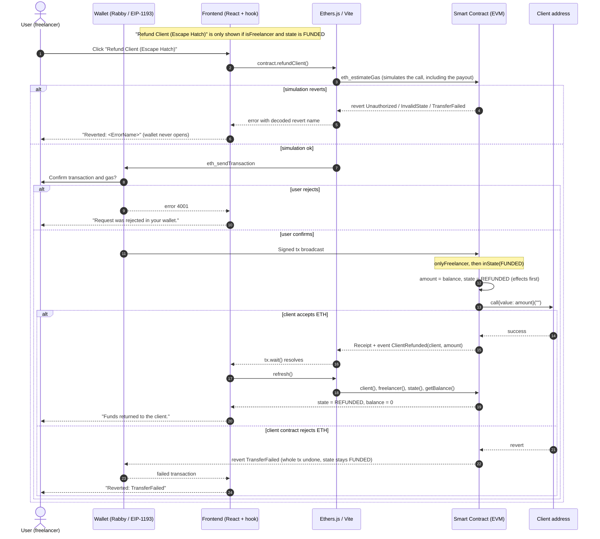
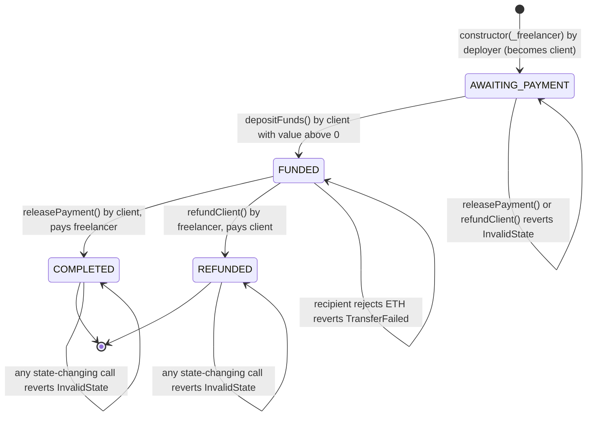

# Diagrams

Visual guide to how the escrow contract, the React frontend and a wallet fit together. All diagrams use [Mermaid](https://mermaid.js.org/), which GitHub renders natively in Markdown.

Contents:

1. [Architecture at a glance](#1-architecture-at-a-glance)
2. [Sequence diagrams](#2-sequence-diagrams): [connect](#21-connect-wallet-and-load-state) · [`depositFunds()`](#22-depositfunds) · [`releasePayment()`](#23-releasepayment) · [`refundClient()`](#24-refundclient)
3. [State machine](#3-state-machine) and [transition table](#transition-table)

Source of truth: `contracts/FreelanceMilestoneEscrow.sol` and `frontend/src/hooks/useEscrowContract.js`. If either changes, update these diagrams.

---

## 1. Architecture at a glance

Notes:

- **Vite** is a build and dev-server tool, not a runtime actor. It bundles the app and injects `VITE_CONTRACT_ADDRESS` from `frontend/.env`. Changing the address means restarting `npm run dev`.
- **The wallet** is the only thing that holds keys. The frontend never sees a private key.
- **The contract** enforces every rule. The frontend only hides buttons that would revert; it does not protect anything.

---

## 2. Sequence diagrams

Common cast in all diagrams below:

- **User**: the person clicking in the browser.
- **Wallet**: Rabby or another injected wallet (`window.ethereum`).
- **Frontend**: `App.jsx` plus the `useEscrowContract` hook.
- **Ethers.js / Vite**: Ethers v6 (`BrowserProvider`, `Contract`), bundled and configured by Vite.
- **Smart Contract (EVM)**: `FreelanceMilestoneEscrow`.

### 2.1 Connect wallet and load state

If the user rejects the connection (error code `4001`), the hook shows "Request was rejected in your wallet." Switching account or network in the wallet triggers `accountsChanged` / `chainChanged`, and the hook reconnects.

### 2.2 `depositFunds()`

Only the client can deposit, and only while the state is `AWAITING_PAYMENT`.

If the state changes between the simulation and mining (for example someone else's transaction lands first), the transaction can still revert on-chain. `tx.wait()` then throws and the hook shows the error the same way.

### 2.3 `releasePayment()`

Only the client can release, and only while the state is `FUNDED`. The whole balance goes to the freelancer.

Because `state = COMPLETED` is set before the payout call, a recipient that tries to call back into the escrow while being paid is refused (`InvalidState`), so it can only be paid once.

### 2.4 `refundClient()`

Only the freelancer can refund, and only while the state is `FUNDED`. The whole balance goes back to the client. This is the escape hatch.

### Live updates in the other person's browser

The hook listens for `FundsDeposited`, `PaymentReleased` and `ClientRefunded`. When any of them is emitted, every connected browser calls `refresh()` and re-reads `client()`, `freelancer()`, `state()` and `getBalance()`. That is why the freelancer's screen updates by itself after the client deposits, with no page reload.

---

## 3. State machine

Reading the diagram:

- The four forward arrows are the only ways state ever changes. Every arrow that loops back to the same state is a **revert**: the transaction is undone and nothing changes (only gas is spent).
- `COMPLETED` and `REFUNDED` are terminal. Nothing can move the escrow out of them.
- Order of checks inside each function: **role first** (`Unauthorized`), **then state** (`InvalidState`), **then amount** (`ZeroDeposit`). So a stranger calling `depositFunds()` with 0 ETH gets `Unauthorized`, not `ZeroDeposit`.
- `TransferFailed` happens after the state was set, but because the whole transaction reverts, the state is rolled back to `FUNDED`. Funds are not lost, but they stay stuck for as long as the recipient keeps rejecting ETH (there is no pull-payment fallback).
- The constructor also reverts with `ZeroAddress` if `_freelancer` is `address(0)`, so no escrow is created.

### Transition table

Who may call what, and what happens. "Revert" means nothing changes.

| Function | Caller | `AWAITING_PAYMENT` | `FUNDED` | `COMPLETED` / `REFUNDED` |
|---|---|---|---|---|
| `depositFunds()` | client | To `FUNDED` (if value > 0, else `ZeroDeposit`) | Revert `InvalidState` | Revert `InvalidState` |
| `depositFunds()` | anyone else | Revert `Unauthorized` | Revert `Unauthorized` | Revert `Unauthorized` |
| `releasePayment()` | client | Revert `InvalidState` | To `COMPLETED` (or `TransferFailed` if the freelancer rejects ETH) | Revert `InvalidState` |
| `releasePayment()` | anyone else | Revert `Unauthorized` | Revert `Unauthorized` | Revert `Unauthorized` |
| `refundClient()` | freelancer | Revert `InvalidState` | To `REFUNDED` (or `TransferFailed` if the client rejects ETH) | Revert `InvalidState` |
| `refundClient()` | anyone else | Revert `Unauthorized` | Revert `Unauthorized` | Revert `Unauthorized` |
| `getBalance()` | anyone | Returns balance | Returns balance | Returns balance |
| plain ETH transfer | anyone | Reverts (no `receive`/`fallback`) | Reverts | Reverts |

Each row corresponds to tests in `test/FreelanceMilestoneEscrow.test.cjs` (see `test_plan.md`, IDs U-03 to U-14, I-03, I-04, S-03). You can also play these transitions in `docs/simulator.html`.
